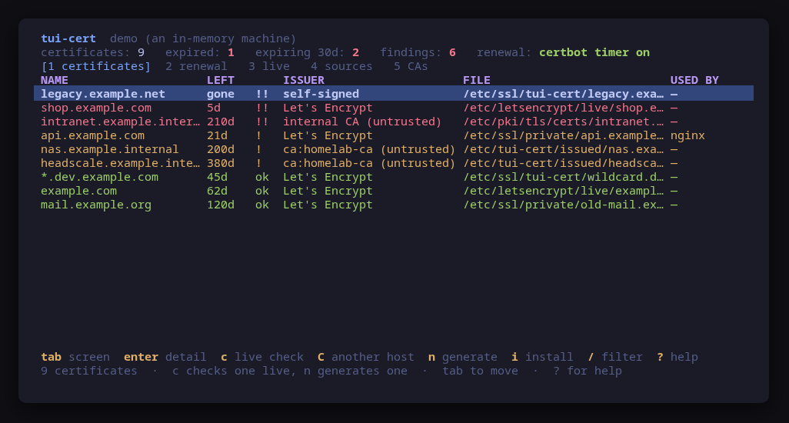
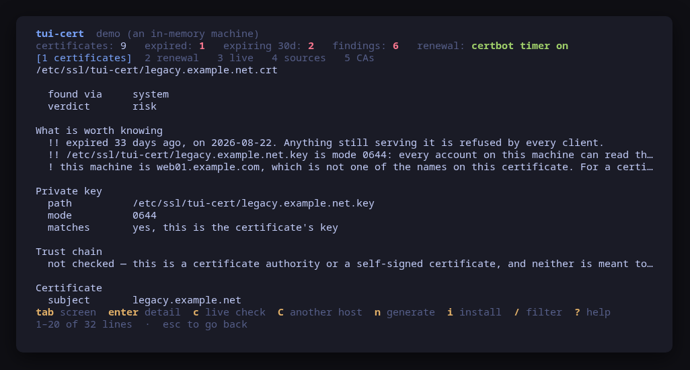
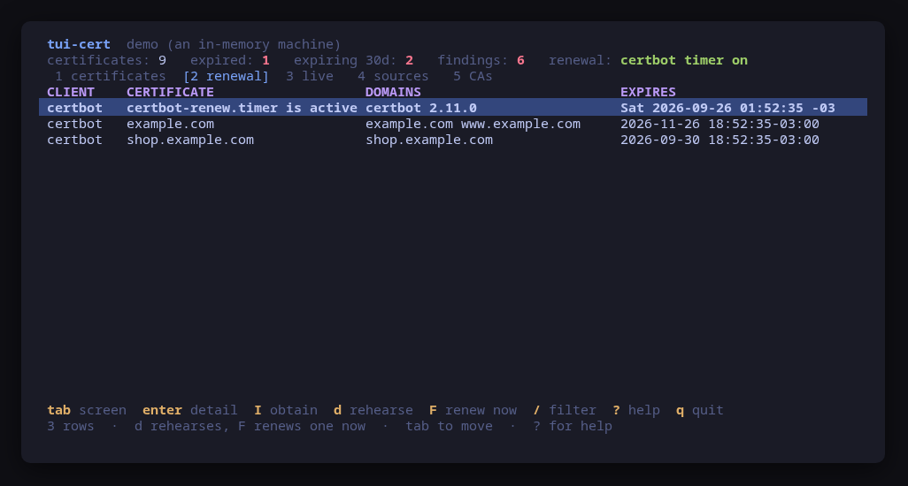
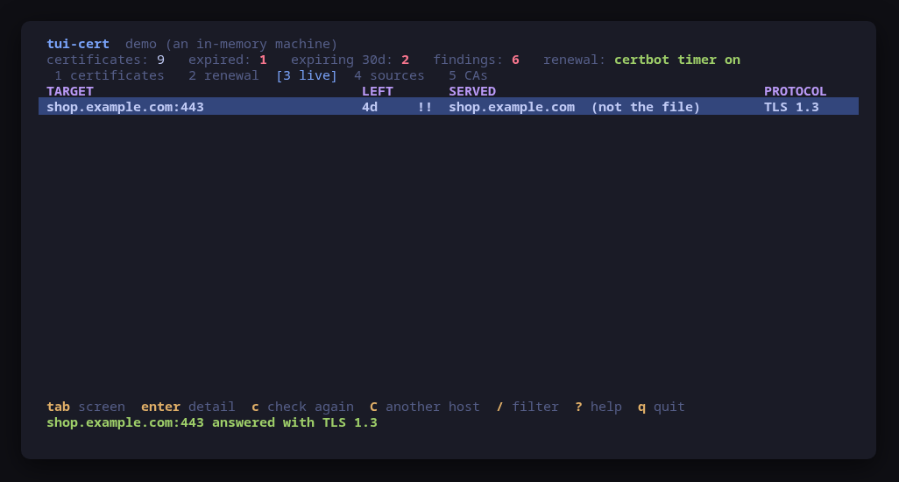
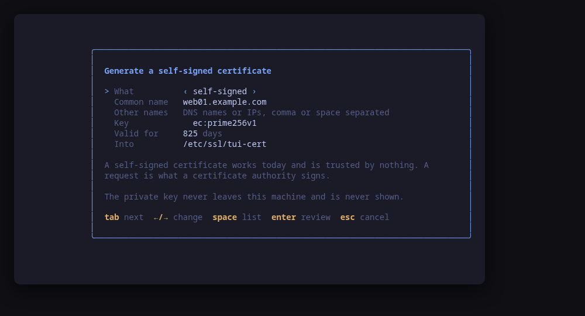
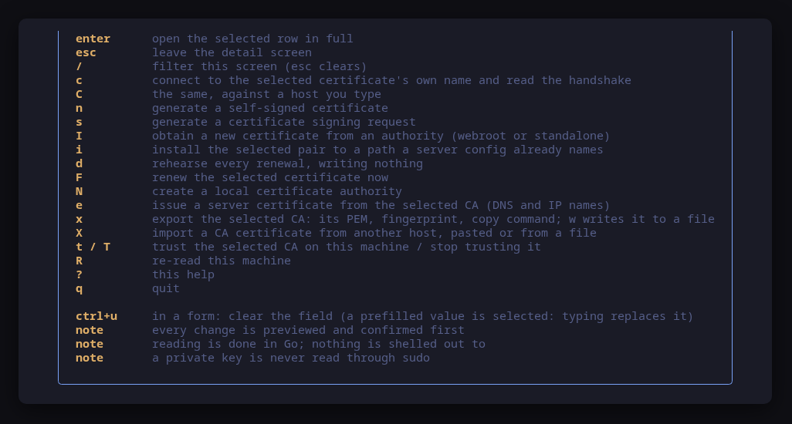

[](https://scorecard.dev/viewer/?uri=github.com/tui-tools/tui-cert)

A terminal UI for the TLS certificates on this machine. It finds them, puts them
on one screen **worst first**, and tells you which one is going to stop working
and when — and it **previews the exact command line of every change before
running it**.

Nothing else on a Linux box will tell you this. `openssl x509 -noout -dates -in`
one file at a time, `certbot certificates` for the ones certbot happens to know
about, `systemctl status certbot.timer` to find out whether renewal is even
running, and `grep -r ssl_certificate /etc/nginx` to find out what is actually
being served. `tui-cert` puts them on one screen, in the
[Omarchy](https://omarchy.org) visual style.



> **Status: early, under validation.** An independent tool that follows the
> Omarchy visual style; it is **not** part of the Omarchy project and not
> endorsed by its maintainers. Expect rough edges.

## Install

<!-- install:start -->
<!-- Generated by tui-kit/tools/render-install.py from tool.json. -->
<!-- Edit the manifest, then run `make readme`. -->

### Arch Linux

Needs the tui-tools repository, which is a [one-time
setup](https://tui-tools.github.io/install/).

The one-liner detects the distribution and adds the repository and its signing
key:

```sh
curl -fsSL https://pkgs.tui.tools/install.sh | sh
```

Piping a script into a shell is not this family's style, so here is the same
setup by hand — read it, or read the script first with `curl -fsSL
https://pkgs.tui.tools/install.sh -o install.sh`:

```sh
curl -fsSL -o /tmp/tui-tools.asc https://pkgs.tui.tools/pubkey.asc
sudo pacman-key --add /tmp/tui-tools.asc
sudo pacman-key --lsign-key \
  "$(gpg --show-keys --with-colons /tmp/tui-tools.asc | awk -F: '/^fpr:/{print $10; exit}')"
printf '[tui-tools]\nServer = https://pkgs.tui.tools/arch/$arch\n' \
  | sudo tee -a /etc/pacman.conf
sudo pacman -Sy
```

Then, and for every other tool in the family:

```sh
sudo pacman -S tui-cert
```

Upgrades then arrive with the rest of your system updates.

### Debian and Ubuntu

Needs the tui-tools repository, which is a [one-time
setup](https://tui-tools.github.io/install/).

The one-liner detects the distribution and adds the repository and its signing
key:

```sh
curl -fsSL https://pkgs.tui.tools/install.sh | sh
```

Piping a script into a shell is not this family's style, so here is the same
setup by hand — read it, or read the script first with `curl -fsSL
https://pkgs.tui.tools/install.sh -o install.sh`:

```sh
sudo install -d -m 0755 /etc/apt/keyrings
curl -fsSL https://pkgs.tui.tools/pubkey.asc \
  | sudo gpg --dearmor -o /etc/apt/keyrings/tui-tools.gpg
echo "deb [signed-by=/etc/apt/keyrings/tui-tools.gpg] https://pkgs.tui.tools/deb stable main" \
  | sudo tee /etc/apt/sources.list.d/tui-tools.list
sudo apt update
```

Then, and for every other tool in the family:

```sh
sudo apt install tui-cert
```

Upgrades then arrive with the rest of your system updates.

### Fedora and RHEL

Needs the tui-tools repository, which is a [one-time
setup](https://tui-tools.github.io/install/).

The one-liner detects the distribution and adds the repository and its signing
key:

```sh
curl -fsSL https://pkgs.tui.tools/install.sh | sh
```

Piping a script into a shell is not this family's style, so here is the same
setup by hand — read it, or read the script first with `curl -fsSL
https://pkgs.tui.tools/install.sh -o install.sh`:

```sh
sudo rpm --import https://pkgs.tui.tools/pubkey.asc
sudo curl -fsSL -o /etc/yum.repos.d/tui-tools.repo https://pkgs.tui.tools/rpm/tui-tools.repo
sudo dnf makecache
```

Then, and for every other tool in the family:

```sh
sudo dnf install tui-cert
```

Upgrades then arrive with the rest of your system updates.

### Any distribution, static binary

```sh
curl -fsSL https://github.com/tui-tools/tui-cert/releases/download/v0.1.1/tui-cert_0.1.1_linux_amd64.tar.gz | tar -xz tui-cert
sudo install -m0755 tui-cert /usr/local/bin/tui-cert
```

One static binary. Verify it against checksums.txt from the same release.

### From source

```sh
git clone https://github.com/tui-tools/tui-cert
cd tui-cert && make build
sudo install -m0755 bin/tui-cert /usr/local/bin/tui-cert
```

Needs Go 1.27 or newer.

Not packaged for these yet; the static binary works everywhere in the meantime.

### Arch Linux (AUR) — coming soon

```sh
paru -S tui-cert-bin
```

The -bin package installs the released static binary.

### openSUSE — coming soon

Needs the tui-tools repository, which is a [one-time
setup](https://tui-tools.github.io/install/).

```sh
sudo zypper install tui-cert
```

The rpm repository is shared with dnf; zypper support is not tested yet.

### Verify a download

Every release of `tui-cert` ships a `checksums.txt`. Check an archive against
it before installing:

```sh
sha256sum -c checksums.txt --ignore-missing
```
<!-- install:end -->

One static binary, no daemon, no state of its own. Nothing keeps running after
you quit.

## Try it without root

```sh
tui-cert --demo
```

`--demo` runs against a sample machine with seven certificates in the seven
states a real one is found in: one that is fine, one expiring in five days that
a renewal has quietly stopped happening for, one self-signed and long expired
with its key world-readable, one from a private authority whose key is **not**
its key, a wildcard, one an nginx configuration serves, and one nothing on the
machine refers to any more. Every key works, every command is built and
previewed for real, and nothing touches your system.

The demo's certificates are generated with `crypto/x509` when it starts and
thrown away when it exits. There is no private key in this repository, not even
a throwaway one.

## Reading a certificate is not a shell out

The whole inventory is Go: `crypto/x509` parses the chain, verifies it against
the system trust store, reads the extensions and compares the public key against
the private key beside it. So it all works on a machine with **no openssl, no
certbot and nothing else installed** — a container, a minimal image, an
appliance.

`certbot`, `acme.sh` and `openssl` are optional and only ever used to *act*:
list what a client manages, ask it to renew, generate a key pair. A machine
without them loses those keys and keeps every screen, and the sources screen
says exactly what each missing one costs.

## Where it looks

- `/etc/letsencrypt/live/*` — the certbot tree
- `/etc/ssl/private`, `/etc/ssl/localcerts`, `/etc/pki/tls/{certs,private}`
- `/etc/ssl/tui-cert` and `~/.local/share/tui-cert` — what this tool writes
- `/etc/acme.sh` and `~/.acme.sh`
- `/var/lib/caddy/.local/share/caddy/certificates` — read-only; Caddy renews
  these itself and a second tool writing there is how a working setup breaks
- every path an `nginx`, Apache or Caddy configuration names —
  `ssl_certificate`, `SSLCertificateFile`, `tls` — parsed out of the text,
  read-only
- anything you list yourself in `paths`

`/etc/ssl/certs` is deliberately **not** searched. On Debian and its derivatives
that directory is the system trust store: several hundred CA certificates, none
of them this machine's, and listing them would bury the four that matter under
the whole of Mozilla's root program. The CA bundles under `/etc/pki/tls/certs`
are skipped by name for the same reason.

Two of those directories are mode 0700 on every distribution, so reading them
escalates through `sudo -n`, which never prompts. A machine where it would
prompt loses those certificates and keeps the rest, and the sources screen says
which.

## Findings first

The list is not sorted by path. It is sorted by what needs you today:

| | |
| --- | --- |
| `!!` | expired, or expiring inside 7 days — a renewal that was going to happen on its own would have happened by now |
| `!!` | the private key beside it is **not** this certificate's key |
| `!!` | the key file is world-readable: treat it as disclosed |
| `!!` | an RSA key under 2048 bits, or a curve under P-256 |
| `!` | expiring inside 30 days, which is the window an ACME client renews in |
| `!` | the chain does not verify against the system trust store, with the exact error |
| `!` | the key file is group-readable |

One opinion is deliberately quieter than a checklist would have it. A
certificate whose names are not this machine's host name is **not** a finding on
its own: a reverse proxy serves somebody else's name and does nothing else. It
is only raised for a certificate somebody made *privately for this machine* —
self-signed, or from an internal authority — because there a wrong name is a
wrong name. A list that flags what everybody runs teaches you to stop reading
the list.



`enter` opens the row: every certificate in the chain with its subject, issuer,
validity, serial, SHA-256 fingerprint, key usage and OCSP and CRL endpoints; the
key beside it with its mode and whether it matches; the chain verification with
the exact error; and the configuration lines that reference the file, by name
and line number.

## Private keys

A private key is never read through `sudo`.

The mode is read from a `stat`, which is what the world-readable finding is. The
key itself is opened only when the ordinary user can already open it, and only
to derive its public half and compare it with the certificate's — the material
is never held, never printed and never put in a command line. A key this user
cannot open is reported as **unknown**, not as a mismatch: sending somebody to
replace a certificate that was fine would be worse than saying nothing.

An encrypted key is refused rather than prompted for. A passphrase typed into
this tool would be a secret it has no business holding.

## Does anything renew?



`2` is what certbot or acme.sh says it manages, and — the question behind half
the findings — whether its **timer is actually running**. A certificate expiring
in five days on a machine with certbot installed is almost never a certbot
problem; it is a timer that is not active, and that is a fact on this screen
rather than something to go and check.

- `d` rehearses **every** renewal: `certbot renew --dry-run`, which runs the
  whole exchange against the staging authority and writes nothing. It is the way
  to find out whether the renewal that is failing would work.
- `F` forces one: `certbot renew --cert-name X --force-renewal`. The dialog says
  what that costs — Let's Encrypt allows 5 duplicate certificates per week, and
  a week is a long time to wait for the sixth.

`acme.sh` has no rehearsal that changes nothing, so it is not offered one; it is
refused in its own words rather than mapped onto something that is not a
rehearsal. acme.sh also renews from a crontab entry rather than a timer, and
`tui-cert` does not read anybody's crontab — the screen says so instead of
claiming nothing is scheduled.

## What the server is really serving



`c` opens **one** TLS connection to the selected certificate's own name, reads
the handshake and closes the socket. No request is sent. `C` does the same
against a host you type, for a port or a machine no certificate here carries.

This is the one thing in the tool that touches the network, and it only ever
happens because a key was pressed: starting `tui-cert` opens no connection, and
neither does `--check`.

What it is for is the failure nothing else on the machine reports: a certificate
that was **renewed on disk and never reloaded**. The file is new, the server is
still serving what it started with, and the only way to find out is to connect.
The screen compares the served certificate's fingerprint with the file's and
says `(not the file)` when they differ.

It also reports the negotiated protocol and cipher, whether an OCSP response was
stapled, and — because it looks at what is there rather than refusing it — an
expired or self-signed certificate that a verifying client would simply have
rejected without telling you why.

## Making one



`n` generates a self-signed certificate and `s` a signing request, through a
form with six fields and no free-text surprises. The plan is three commands and
all three are on screen before any of them runs:

```
install -d -m 700 /etc/ssl/tui-cert
openssl req -x509 -newkey ec -pkeyopt ec_paramgen_curve:prime256v1 -nodes \
  -keyout /etc/ssl/tui-cert/web01.example.com.key \
  -out /etc/ssl/tui-cert/web01.example.com.crt \
  -days 825 -subj /CN=web01.example.com \
  -addext subjectAltName=DNS:web01.example.com,DNS:web01
chmod 600 /etc/ssl/tui-cert/web01.example.com.key
```

The mode is set in its own command because `openssl` leaves the key at whatever
the umask allows, which on most machines is 0644 — the exact finding this tool
exists to raise. The common name is always the first subject alternative name,
because a certificate whose CN is not also a SAN has not been accepted by
anything since 2017. A wildcard cannot be a file name, so `*.dev.example.com` is
written as `wildcard.dev.example.com` and still carries the wildcard inside. And
a file the plan would overwrite is named on the dialog before you answer.

The destination is `/etc/ssl/tui-cert` when running as root and
`~/.local/share/tui-cert` when not, so an ordinary user is never handed a plan
that fails on its first command.

## Usage

```sh
tui-cert                       # read this machine
tui-cert --demo                # sample machine, no privileges needed
tui-cert --check               # read, print JSON, exit
tui-cert --path /srv/tls       # scan somewhere else too; repeatable
tui-cert --theme ~/mytheme/colors.toml
tui-cert --sudo ""             # run the commands directly (as root)
tui-cert --version
```

### `--check`, for scripts and tests

`--check` is the non-interactive read path: it loads the machine through the
same backend the UI would use, prints what it parsed as JSON and exits 0, or
exits 1 with the reason if the backend cannot be read. No UI, no mutation, and
no network connection, so it is safe to run anywhere.

```console
$ tui-cert --check | head -12
{
  "tool": "tui-cert",
  "version": "0.1.0",
  "backend": "pki",
  "describe": "read with crypto/x509; certbot, openssl for the actions",
  "certificates": 7,
  "expired": 1,
  "expiring7": 1,
  "expiring30": 2,
  "mismatches": 1,
  "weakKeys": 0,
  "exposedKeys": 1,
```

A machine with **no** certificates is a real machine, and `"certificates": 0`
with the searched locations listed beside it is the true answer for it — not an
error.

It exists so a test can assert on what the tool *parsed* rather than on what it
painted. [tui-lab](https://github.com/tui-tools/tui-lab) uses it to test this
tool against real machines on Ubuntu, Fedora and Arch; the assertions live in
[`test/smoke.sh`](test/smoke.sh), and every one of them is read-only — the suite
makes its own certificate with `openssl` in `$TMPDIR` and points the tool at it
through the configuration, so it can assert on a subject and a day count it
chose itself.

## What it can do to your machine

Every one of these is previewed and confirmed first.

| Key | What runs |
| --- | --- |
| `d` | `certbot renew --dry-run` |
| `F` | `certbot renew --cert-name <name> --force-renewal`, or `acme.sh --renew -d <name> --force` |
| `n` / `s` | `install -d -m 700 <dir>`, then `openssl req …`, then `chmod 600 <dir>/<name>.key` |

Nothing else. There is no other code path that writes a file, and the only
directory written to is the one the form showed you.

## Keys

| Key | Action |
| --- | --- |
| `tab` / `1`–`4` | Move between certificates, renewal, live checks and sources |
| `↑`/`k`, `↓`/`j` | Move the selection, or scroll the detail screen |
| `g` / `G` | First / last row |
| `pgup` / `pgdn` | Scroll a page |
| `enter` | Open the selected row in full |
| `esc` | Leave the detail screen |
| `/` | Filter this screen (`esc` clears) |
| `c` | Connect to the selected certificate's own name and read the handshake |
| `C` | The same, against a host you type |
| `n` | Generate a self-signed certificate |
| `s` | Generate a certificate signing request |
| `d` | Rehearse every renewal, writing nothing |
| `F` | Renew the selected certificate now |
| `R` | Re-read this machine |
| `?` | Help |
| `q` | Quit |

In the **generator**: `tab` moves between fields, `←`/`→` cycles a choice,
`space` opens the list, `enter` builds the plan and shows it, `esc` cancels.



## What v0.1 can do

- Find the certificates on the machine: the Let's Encrypt tree, `/etc/ssl`,
  `/etc/pki`, the acme.sh and Caddy stores, the paths an nginx, Apache or Caddy
  configuration names, and anything you add through `paths`.
- Parse PEM and DER, single certificates and full chains, entirely in Go.
- Report subject, SANs, issuer and issuer family, validity with days left, key
  type and size, serial, SHA-256 fingerprint, key usage, extended key usage and
  the OCSP and CRL endpoints.
- Verify the chain against the system trust store and print the exact error when
  it does not, distinguishing a private authority from a missing intermediate.
- Report the private key beside each certificate — present, its mode, and
  whether its public half is the certificate's — without ever reading one
  through `sudo`.
- Say which nginx, Apache or Caddy configuration file and line serves each one.
- Judge the lot: expired, expiring, key mismatch, weak key, exposed key,
  unverifiable chain, and a wrong name on a privately issued certificate.
- Report certbot and acme.sh, what they manage, and whether the renewal timer is
  running; rehearse a renewal; force one, with the rate limit spelled out.
- Open one TLS connection on demand and compare what is served with what is on
  disk.
- Generate a self-signed certificate or a signing request, previewed as three
  commands, with the key left at mode 600.
- Follow the active Omarchy theme, and respect `NO_COLOR`.

## What v0.1 cannot do

- **No certificate is ever deleted, moved or rewritten.** The only thing written
  is a new pair, into a directory you chose.
- **No revocation check.** The OCSP and CRL endpoints are shown; nothing is
  fetched from them. A live check reports whether a response was *stapled*,
  which is a fact about the handshake rather than a query.
- **No ACME account management**, no issuing a real certificate, no DNS
  challenge. Getting a certificate is certbot's job; this shows you what
  happened.
- **No Caddy management.** Its storage is reported, read-only.
- **No Java keystores, no PKCS#12, no NSS databases.** PEM and DER only.
- **No `Include` following in server configurations.** The directives are read
  out of the files under `/etc/nginx`, `/etc/apache2`, `/etc/httpd` and
  `/etc/caddy`; a certificate named from somewhere else is still listed if it is
  in one of the scanned directories, it just will not say who serves it.
- **No client certificates or CA operation.** No `openssl ca`, no signing.

## Compatibility

<!-- compat:start -->
<!-- Generated by tui-kit/tools/render-compat.py from tool.json. -->
<!-- Edit the manifest, then run `make readme`. -->

`tui-cert` probes its backend once at startup and shows the version in the
header. A version nobody has tested is marked `(untested)` there rather than
hidden; one below the minimum is marked as such and the tool still runs.

### certbot

| | |
| --- | --- |
| Binary | `certbot` |
| Version read with | `certbot --version` |
| Minimum | 1.0 |
| Tested | none yet |

| Versions | What changes |
| --- | --- |
| `>=1.0` | certbot is optional: without it the inventory, the chain validation, the key match and the live check all still work, and only the renewal screen's two keys say there is nothing here to renew with |
| `<2.0` | a certificate renewed by this certbot keeps the RSA key type it was issued with; from 2.0 the default became ECDSA, so a renewal there can change the key type of a certificate a client was pinned to |

### acme-sh

| | |
| --- | --- |
| Binary | `acme.sh` |
| Version read with | `acme.sh --version` |
| Minimum | 3.0.0 |
| Tested | none yet |

| Versions | What changes |
| --- | --- |
| `>=3.0.0` | acme.sh renews from a crontab entry rather than a systemd timer, and tui-cert reads nobody's crontab: the renewal screen says so instead of claiming nothing is scheduled |

### openssl

| | |
| --- | --- |
| Binary | `openssl` |
| Version read with | `openssl version` |
| Minimum | 1.1.1 |
| Tested | `3.0.13`, `3.5.5`, `3.6.4` |
| Version-gated features | `addext` (since 1.1.1) |

| Versions | What changes |
| --- | --- |
| `<1.1.1` | `openssl req` has no `-addext`, so a subject alternative name cannot be set on the command line; tui-cert will not write an openssl configuration file, so the generate keys say why they are unavailable rather than producing a certificate no client accepts |
| `>=1.1.1` | openssl is only ever used to generate a key pair; nothing is read with it, so a machine without it loses two keys and keeps every screen |

The tested versions are generated from `compat/results.jsonl`, which the tool's
own smoke test appends to when it runs against a real machine in
[tui-lab](https://github.com/tui-tools/tui-lab).
<!-- compat:end -->

## Configuration

`/etc/tui-cert/config.toml`, then `~/.config/tui-cert/config.toml` (the user file
overrides the machine-wide one), then `TUI_CERT_*` in the environment. Flags
override everything. See [`examples/config.toml`](examples/config.toml).

```toml
# Extra files or directories to scan, separated the way $PATH is.
paths = ""

# Where a generated certificate is written; empty picks /etc/ssl/tui-cert as
# root and ~/.local/share/tui-cert otherwise.
create-dir = ""

# Privilege escalation prefix; "" runs the command directly.
sudo = "sudo -n"

# Path to an Omarchy-style colors.toml; empty follows the active theme.
theme = ""
```

The family's configuration files are flat `key = "value"` pairs — that is the
format every tool in it reads, and it is a contract with the user rather than
with a TOML spec. So `paths` is a list in the shape `$PATH` is written in,
rather than a `[[paths]]` table: one key, one line, and `TUI_CERT_PATHS` works
the same way.

## Theme

The default palette is **Tokyo Night**. On Omarchy, the tool reads the active
desktop theme from `~/.config/omarchy/current/theme/colors.toml` and follows it.
`TUI_THEME` or `--theme` override; `NO_COLOR` drops color and keeps layout. The
rules live in [tui-kit](https://github.com/tui-tools/tui-kit#theme-rules).

## Architecture

The UI never builds a `certbot`, `acme.sh` or `openssl` command line, and never
opens a file. It talks to `internal/certs.Backend`, which returns a
tool-neutral model:

```
Model{Entries, ACME, Tools, Locations, Caddy, Hostname, Now}
Entry{Path, Source, Chain, Key, References, ChainVerified, Verdict, Findings}
Cert{Subject, SANs, Issuer, IssuerKind, NotAfter, DaysLeft, KeyType, KeyBits,
     Serial, Fingerprint, KeyUsage, ExtKeyUsage, OCSP, CRL, IsCA, SelfSigned}
Live{Target, Protocol, Cipher, Chain, Stapled, FilePath, Matches, Findings}
```

`internal/pki` is the only package that starts a process, and it starts one for
six programs — `certbot`, `acme.sh`, `openssl`, `systemctl`, `install` and
`chmod`, plus `cat`, `ls` and `stat` as the escalated fallbacks for a directory
an ordinary user cannot open. Reading a certificate is not among them.
[`check-exec.sh`](https://github.com/tui-tools/tui-kit/blob/main/tools/check-exec.sh)
fails the build if any other package imports `os/exec`.

The scanner takes its three file operations — read, list, stat — as parameters,
so the same code runs against the real machine, against a temporary tree in the
tests, and against the in-memory machine `--demo` builds. That is why `--demo`
exercises the parser rather than a shortcut around it.

Mutations are `runner.Command` values produced by the backend. The UI shows them
and, on confirmation, hands the same ones back to the
[kit runner](https://github.com/tui-tools/tui-kit#the-contract-preview-confirm-run),
which resolves the binary and the privilege prefix. That is the whole trust
boundary, and it is why the preview is guaranteed to match what executes.

## Development

```sh
make check        # gofmt, go vet, the exec boundary and the tests: what CI runs
make test
make build
make demo
make screenshots  # re-render the frames above from --demo
```

The certificate tests generate their own certificates with `crypto/x509` at test
time — expired ones, mismatched pairs, 1024-bit keys, private authorities — and
throw them away with the temporary directory. **No key material is committed to
this repository.** A private key in a git history is a private key forever, even
a throwaway one, and a repository that ships one teaches everybody who copies it
to ship one too.

What *is* in `internal/pki/testdata` is text: nginx, Apache and Caddy snippets,
and the output `certbot certificates`, `acme.sh --list`, `openssl version` and
`systemctl show` print.

Dependencies are deliberately small: Bubble Tea, Bubbles and
[tui-kit](https://github.com/tui-tools/tui-kit), which carries the palette, the
widgets, the config loader and the command runner shared by the whole family.

## Safety notes

- **A forced renewal spends a rate limit.** Let's Encrypt allows 5 duplicate
  certificates for the same set of names per week. Renew by hand when the timer
  has failed or the key has to change; a certificate that is simply due will be
  renewed on its own.
- **A self-signed certificate is trusted by nothing** until it is installed in
  each client's own trust store. The dialog says so before it generates one.
- **A world-readable key is a disclosed key.** Fixing the mode does not undo
  that; the certificate has to be replaced with a new key.
- Three reads escalate, unprompted, through `sudo -n`: `ls`, `stat` and `cat`,
  for the certificate directories an ordinary user cannot open. A private key is
  never one of them.
- The live check is the only network access, it only happens when you press a
  key, and it sends nothing.
- `tui-cert` re-reads the machine after every change, so what you see is what
  the system reports, not what the tool assumed.

## License

MIT — see [LICENSE](LICENSE). Part of the
[tui-tools](https://github.com/tui-tools) family.
